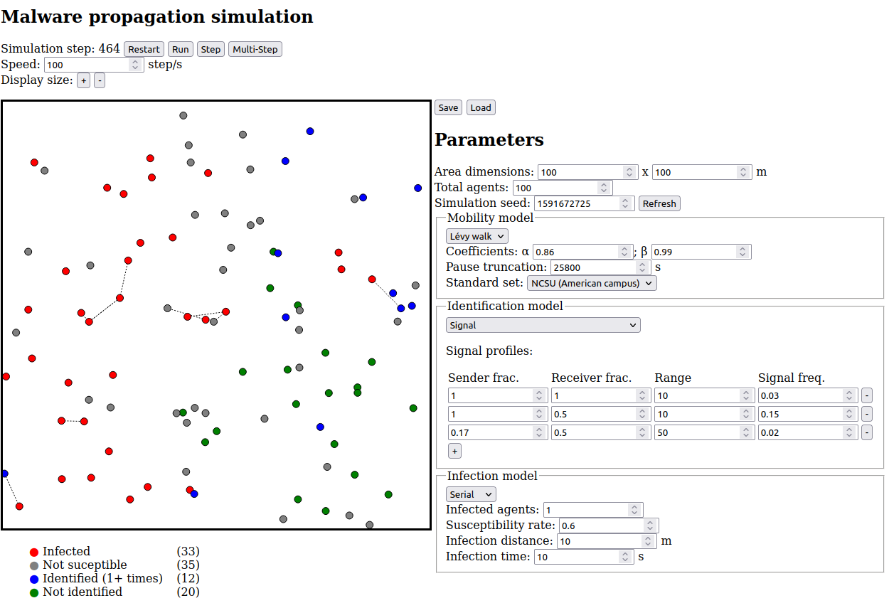

Bluetooth worm simulator
========================

This application accompanies the paper "Modelling the propagation of modern Bluetooth worms" and implements an 
agent-based simulator for the propagation of worm malware that spreads among personal smartphones via Bluetooth.

The simulator allows experimentation with different mobility, identification and infection models that can be 
independently configured or swapped out.

Installation
------------

The simulator can be build using [GHC](https://www.haskell.org/ghc/) and its dependencies installed via 
[Cabal](https://www.haskell.org/cabal/). Once GHC and Cabal are installed, you can navigate to the `src` directory
and run the `build-ws.sh` and `build-er.sh` shell scripts to install dependencies and respectively build the WebSocket
and CLI interfaces.

Using the GUI
-------------

After successfully running `build-ws.sh` you can now run the local WebSocket server via `bin/ws-server`, which will
listen on `localhost:4243`. 

While the WebSocket server is running, simply open `ui/app.html` in your browser (no need for an HTTP server, it will 
work fine when opened via `file:` URI). You should now be able to configure and run simulations. The `Save` and `Load`
buttons can store one configuration in browser Local Storage.

Using the CLI
-------------

You can execute `bin/exp-runner` to more efficiently perform simulations based on a JSON config file. It will 
output a CSV file with periodic propagation results. Refer to the `experiments` directory for example configurations. 

You can also use the GUI to create configuration files: whenever you click `Start`, `ws-server` will output the JSON
corresponding to the current configuration to stdout. This can be stored in a file and directly fed to `exp-runner`.

Currently available models
--------------------------

The following mobility, identification and infection models are currently implemented and available via the GUI and CLI:

- Mobility models:
    * [Lévy Walk model by by Rhee et al.](https://ieeexplore.ieee.org/document/5750071)
    * [BSA model by Haas](https://ieeexplore.ieee.org/abstract/document/627227)
    * [SMOOTH model by Munjal et al.](http://www.eurecom.fr/~spyropou/papers/Smooth-Infocom2011.pdf)
- Identification models:
    * _Dummy_:  all agents are immediately identified by all others
    * _Signal_: signal profile model described in the paper
    * _Gaussian_, _PeriodicTrigger_ and _Broadcast_: experimental; replaced by Signal model
- Infection models:
    * _Serial_: [The serial infection model employed by Zyba et al.](https://ieeexplore.ieee.org/abstract/document/5062067)
    * _Simple_: experimental parallel infection model with failure probabilities.

Implementing a new component model
----------------------------------

You can implement a new component model by adding a Haskell module that provides an implementation of the 
`SimulationModel` type class, as well as an implementation of either `MobilityModel`, `IdentificationModel` or 
`InfectionModel`. The data type implementing these classes contains the parameters of your model. It should also derive
`FromJSON` so that it can be dynamically configured.

To enable support in the CLI, edit the module `Model.UI.JSON` and add the model to one of the lists `mobModels`, 
`idModels` or `infModels`. You can provide a name here that is used to identify the model in the JSON configuration 
file.

Refer to the existing model classes in `src/Model` for examples.

